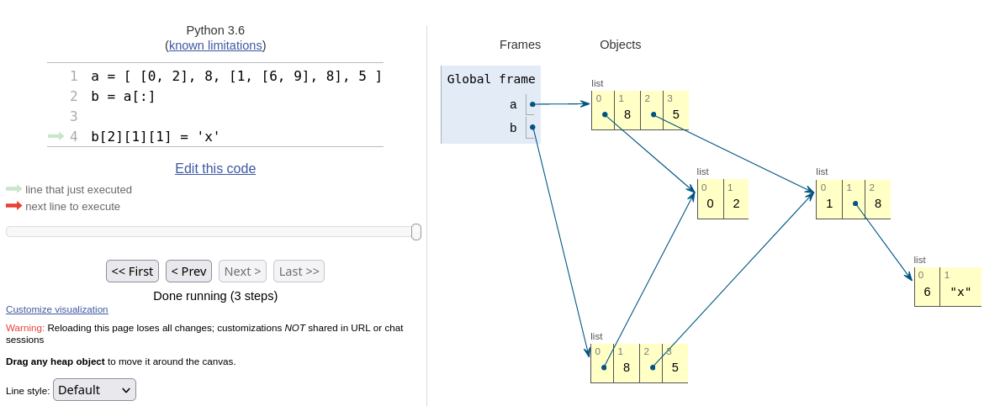

# Argomenti

* L'operatore di assegnamento su liste (*aliasing*)

* L'algoritmo di ordinamento *bubble-sort*: descrizione e implementazione in python.

* [Video della lezione](https://www.dropbox.com/s/h6rnafnko9b3y3a/20211202-lezione_16.mp4?dl=1)

# Esercizi

**1**: Il bubble-sort, così come lo abbiamo implementato a lezione a partire dalla seconda scansione in poi esegue un numero crescente di confronti inutili in quanto gli elementi più grandi hanno già raggiunto la loro posizione finale nella lista. Modificare l'implementazione evitando questi confronti inutili.

**2**: Supponiamo che la lista *a* contenga liste annidate, l'operazione di copia tra liste con slicing si limita a clonare la lista principale (radice) creando 
alias per le liste annidate. 

(La figura mostra uno screenshot di [Python Tutor](https://pythontutor.com/) raffigurante lo stato delle variabili dopo una operazione di clonazione e di assegnamento ad un elemento di una lista annidata).

Scrivere una funzione Python denominata *deep_copy* che clona la lista in input e tutte le liste annidate che essa contiene.

*Suggerimento*. Ci si ispiri alla funzione *conta_elem_tna* descritta nella [Lezione 14](https://github.com/glucatv/Programmazione-dei-Calcolatori-aa21-22/tree/main/20211125-lezione_14).

